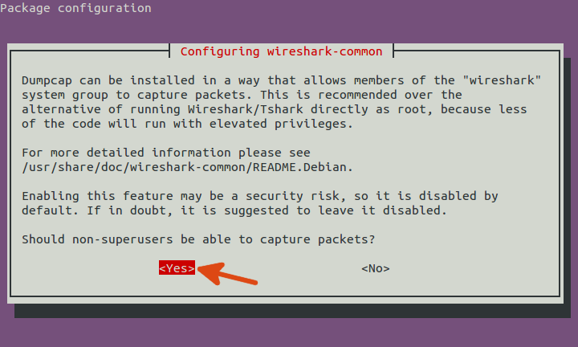

# Purpose
This directory contains scripts and tools for benchmarking post-quantum safe SSH.
# Requirements
Tested for Ubuntu 18.04 and 20.04/20.10.

## Clone this repository

1. Run `git clone --branch benchmark https://github.com/fhnw-ise-qcrypt/oqs-demos.git` in the desired location to clone this repository and checkout branch `benchmark`.

## Install docker

1. See [here](https://link) how to install docker and install it.
2. Run `sudo adduser $USER docker` to add your user to the group docker
3. Reboot, log out and in again or run `newgrp docker`. The latter only has an effect on the current shell. So it would need to be run again in a new shell.
## Build the docker image

1. Navigate to `oqs-demos/openssh`
2. Run `docker build --build-arg MAKE_INSTALL=install -t oqs-openssh-img .`

Note that the current version uses `liboqs` version 0.4.0, so not entirely all NIST PQC round 3 candidates are supported. But as for the finalists, all algorithms and almost all parameter sets (except some NTRU sets) are available for testing.

## Install `tshark`

1. Run `sudo apt install tshark`
2. While installing you will be prompted with the following window for some package configuration.
    
   
    
   Choose `<Yes>` and press `<Enter>`
3. Run `sudo adduser $USER wireshark` to add your use to the wireshark group
4. Reboot, log out and in again or run `newgrp wireshark`. The latter only has an effect on the current shell. So it would need to be run again in a new shell.
5. Test if `tshark` is working by typing `tshark -i any` and see if it starts capturing traffic.

# Setup

Before we can run the benchmark, we need to set up both the server and the client for the test. Both is done via a script and some configuration files.

Said scripts can be found in `oqs-demos/openssh/benchmark`.
- `listofsigs.conf` contains a list of signature algorithms that can be tested. Every algorithm listed here (that is of course not commented out) will be set up in the setup process. In the case of signature algorithms, setup means generating keys for all enabled algorithms and sending the public keys to the server's `authorized_keys` file.
- `listofkems.conf` contains a list of key exchange algorithms that are enabled. This only affects the set up of the server as it requires to accept those algorithms.

In general it is recommended to initially enable all algorithms (or at least a broad set) for testing, because then when testing you won't accidentally run into algorithms that have not been setup, failing the test. It is possible that enabling more algorithms results in slightly slower key exchange times because the server informs the client before every key exchange about its supported algorithm set, which would result more transmitted data. But the impact of this has not been tested and is suspected to be insignificant.

## Setup server

Setting up the server is as easy as running

`./setup_server.sh`

It will read both `listofsigs.conf` and `listofkems.conf` and start the `oqs-sshd` with corresponding algorithms enabled.

Some options can be adjusted via environment variables:
- `PORT`: The port that will be published and where `oqs-sshd` will listen. Defaults to `2222`
- `CONTAINER`: The docker container is tagged with. Defaults to `oqs-server`
- `DOCKER_IMG`: The name of the docker image that was built in the previous step. Defaults to `oqs-openssh-img`
- `DOCKER_OPTS`: Additional commands to `docker run`. Defaults to nothing
- `DEBUGLVL`: Lets a user set a debug level for debugging the script. Defaults to `0`. Other possible values are `1` and `2`

Example of changing one of those variables:

`DEBUGLVL=2 ./setup_server.sh`

Two of those variables:

`PORT=1234 CONTAINER=oqs-host ./setup_server.sh`

You can of course also set those variables for the current shell by sourcing them.

## Setup client

Similar to setting up the server, but the script also needs the server's ip address:

`./setup_client.sh servers-ip-address`

It will read the `listofsigs.conf` and for each algorithm listed there it will generate an identity key and writes the public key to the server's `authorized_keys` file. It then will do a test handshake for each configured key.

Some options can be adjusted via environment variables:
- `PORT`: The port that will be published and where `oqs-sshd` will listen. Defaults to `2222`
- `CONTAINER`: The docker container is tagged with. Defaults to `oqs-client`
- `DOCKER_IMG`: The name of the docker image that was built in the previous step. Defaults to `oqs-openssh-img`
- `DOCKER_OPTS`: Additional commands to `docker run`. Defaults to nothing
- `DEBUGLVL`: Lets a user set a debug level for debugging the script. Defaults to `0`. Other possible values are `1` and `2`

Example of changing one of those variables:

`DEBUGLVL=2 ./setup_client.sh`

Two of those variables:

`PORT=1234 DEBUGLVL=1 setup_client ./setup_server.sh`

You can of course also set those variables for the current shell by sourcing them.

# Run tests
